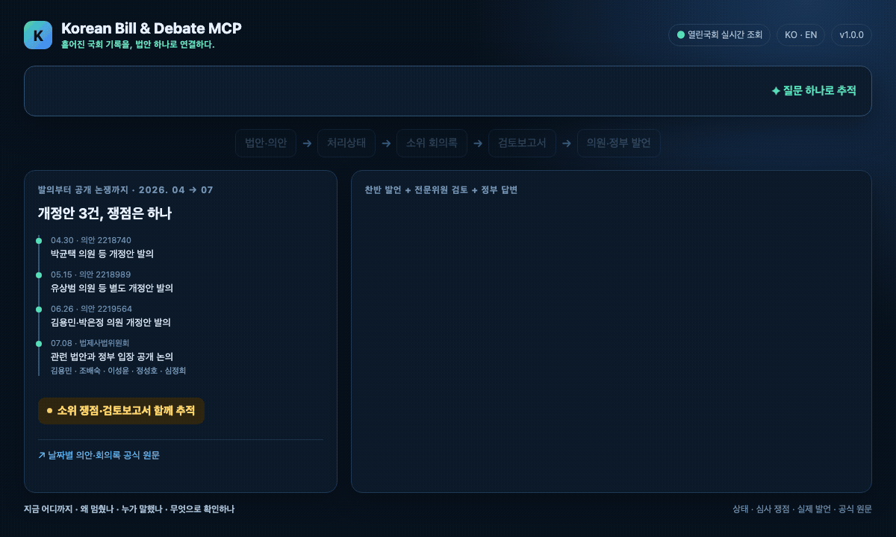

# Korean Bill & Debate MCP

Current version: `v1.0.0`

[한국어](README.md) · [MCP setup guide](docs/mcp-clients.md) ·
[Data sources](docs/data-sources.md) · [Architecture](docs/architecture.md)

**Connect scattered Assembly records around a single bill.**

From a bill's introduction and current status to committee review, expert analysis, and the actual
words exchanged by lawmakers and government officials, the server connects scattered Assembly
records into one evidence trail.

One question answers four parts of legislative research: where a bill stands, why it is moving or
stalled, who said what in context, and which official record proves it.

It is built for people working with legislation inside and outside the Assembly: parliamentary
staff, corporate policy and legal teams, public institutions and associations, researchers,
journalists, and civil-society organizations.

For deeper legislative analysis, it also surfaces two sources insiders look for first:
subcommittee negotiation records and committee expert review reports.


The no-account web workspace is still a Korean-language, single-request alpha. The durable
background workflow in `v1.0.0` is available through the MCP surface first. English users should
use the MCP connection below while the workspace workflow and credential boundary are validated.

## Ask in English, verify the Korean official record

`v0.8.0` preserves the user's English question while converting legislative concepts into Korean
search terms for the official data sources. The connected AI is instructed to answer in English,
label translated quotations, and keep every official source URL beside the claim it supports.

```text
In July 2026, compare bills and opposing views on abolishing prosecutors'
supplementary investigation authority. Include surrounding Q&A and official sources.

For bill 2217784, show its current status, the committee expert review report,
and related statements by lawmakers and government officials.
```

Common legislative topics are handled by the built-in bilingual glossary. For an unfamiliar proper
noun, the MCP tool schema lets Claude or ChatGPT provide a concise `korean_query` while preserving
the English request. Results expose `query_language`, `search_query_ko`, and `source_language` so
the English explanation remains distinguishable from the Korean source record.

The official bill titles, minutes, and review reports remain in Korean. English quotations in the
AI's answer are translations; open the cited official URL when exact Korean wording matters.

### See the research flow



## Connect it to your AI in about three minutes

You do not need to learn a separate research interface. Connect the MCP once, then ask Claude,
Codex, or Gemini a normal question and let the tools retrieve the official Assembly evidence.

### Option 1: Use it on Claude.ai or ChatGPT web — no installation

Issue your personal [Open Assembly API key](https://open.assembly.go.kr/portal/openapi/openApiNaListPage.do)
first. Claude.ai and ChatGPT both connect to the same public MCP endpoint:

```text
https://korean-bill-debate-mcp.vercel.app/mcp
```

For Claude Pro, Max, Team, or Enterprise, open **Settings → Connectors → Add custom connector**,
name it `Korean Bill & Debate`, and enter the public endpoint above. Team and Enterprise owners may
need to enable an organization connector first. See [Anthropic's current custom-connector guide](https://support.anthropic.com/en/articles/11175166-about-custom-integrations-using-remote-mcp).

Complete the OAuth approval screen with your own Open Assembly key. Then open a new chat and enable
the connector and its tools under **Search and tools**. Do not give Claude a `/mcp/t/...` personal
URL. The OAuth flow encrypts the key into access credentials; the raw key is not stored in a
database or file.

OpenAI currently documents full MCP apps for ChatGPT Business, Enterprise, and Edu on the web;
Pro users can also connect read/fetch MCPs in developer mode. Every tool on this server advertises
the MCP read-only annotation. An admin enables developer mode where required; authorized users can
turn it on under **Settings → Apps → Advanced settings**, then use **Settings → Apps → Create** to
add the public endpoint. Click **Scan Tools**, complete OAuth with your Open Assembly key, wait for
the 13-tool scan, create the app, and select it from `+ → More` or an `@` mention in a new chat.
Availability depends on workspace policy. See [OpenAI's current
developer-mode guide](https://help.openai.com/en/articles/12584461-developer-mode-and-full-mcp-connectors-in-chatgpt-beta).

After the server adds tools, use the app's **Refresh** action and review the changed actions;
ChatGPT may keep the previously approved tool snapshot instead of enabling new tools automatically.

> If Claude or ChatGPT was configured with an older `?token=...` or `/mcp/t/...` URL, delete that
> connection and add the public `/mcp` URL above. Personal URLs remain available only for clients
> that cannot complete OAuth and must be treated like passwords.

The public `/mcp` endpoint starts standard OAuth and asks for the key on its approval page. The
legacy `/connect` form instead validates the key against Open Assembly before issuing an encrypted
`/mcp/t/...` URL. Do not use that legacy URL with Claude.ai or ChatGPT.

### Option 2: Install locally for Claude Desktop, Claude Code, Codex, or Gemini CLI

#### 1. Install the prerequisites

Issue your personal [Open Assembly API key](https://open.assembly.go.kr/portal/openapi/openApiNaListPage.do),
then install `uv`. Poppler (`pdftotext`) is recommended for faster PDF extraction; the built-in
Python extractor is used when Poppler is unavailable.

```bash
# macOS
brew install uv poppler

# Ubuntu/Debian
sudo apt-get install poppler-utils
curl -LsSf https://astral.sh/uv/install.sh | sh
```

#### 2. Install the pinned GitHub release

```bash
uv tool install git+https://github.com/epoko77-ai/korean-bill-debate-mcp.git@v1.0.0
```

#### 3. Run one command for the client you use

| AI client | One-time command | Connection |
|---|---|---|
| Claude Desktop | `kbd setup --client claude-desktop` | Local, automatic |
| Claude Code | `kbd setup --client claude-code` | Local, automatic |
| Codex | `kbd setup --client codex` | Local, automatic |
| Gemini CLI | `kbd setup --client gemini` | Local, automatic |

The setup wizard hides and validates your API key, stores it with user-only permissions, and
registers the MCP with the selected client. Your key and downloaded Assembly records stay on your
computer.

Key resolution is `--api-key`, then `ASSEMBLY_OPEN_API_KEY`, then a masked interactive prompt. A
non-interactive process with no key fails immediately instead of hanging. The default credential
file is used unless `--credentials-file` is supplied; a custom file's absolute path is passed to
the registered MCP process.

Confirm that the result contains `"installed": true`. The command exits with an error when the
client executable is missing or registration fails.

#### 4. Restart the client and ask

```text
For bill 2219564, connect its text and current status to relevant subcommittee minutes,
expert review reports, and statements by lawmakers and government officials. Cite official sources.
```

The local live-cache compatibility server exposes eight tools. A fully configured durable hosted
deployment exposes those eight plus `start_research`, `get_research_status`,
`get_research_overview`, `get_research_page`, and `get_evidence_document`—13 tools in total. See
the [client-by-client guide](docs/mcp-clients.md) for exact names, UI paths, manual configuration,
verification, and troubleshooting.

Both web and local modes use each user's own Open Assembly API key. The hosted connection does not
store the raw key in a database or file. Local mode downloads only relevant official records and
keeps a private cache for repeat performance. Neither mode requires a prebuilt Assembly database.

## Request flow

```text
natural-language question
  → live official bill and status lookup
  → relevant committee, plenary, or subcommittee discovery
  → bounded download and parsing of official minutes
  → bill–meeting–person–speech–reply connections
  → answer-ready evidence with official URLs and source locators
```

For broad research, `v1.0.0` returns a `research_id` immediately. It first exposes candidates
validated on the first official page of every planned source family, explicitly marked
`metadata_inventory_complete=false`, while the same job continues through every source page. It
then guides the client through the complete paginated bill/meeting/document map, prioritized core
sources, and any additional sources selected by the user. Only an explicit exhaustive request
walks the entire evidence index with `exhaustive=true` and every long source range. Long text is
not replaced by a truncated preview: it is routed by exact ID, size, hash, URL, and locator.

As soon as all planned first pages are ready, `get_research_status` includes up to 100 observed
entries in `overview_preview`. Claude.ai and ChatGPT can show useful progress without waiting for
full discovery. This preview is one orientation page of at most 100 entries. While
`metadata_inventory_complete=false`, clients must keep polling the same `research_id` rather than
mixing offset pages from a changing inventory. Only the complete metadata map is paged through
every returned `next_offset`.
Its `next_action` includes a `view_source_hash`, pinning every offset to one immutable candidate map
even if the final result becomes ready during traversal.

In local mode, SQLite is a private cache rather than a bundled source database. Hosted instances use
ephemeral cache storage. Current bill status is refreshed from the official status API. See the
[Korean README](README.md) and [client guide](docs/mcp-clients.md).

### Current `v1.0.0` limits

The optional revision-bound corpus path exists in code, but a complete official-record corpus has
not yet been built, deployed, and operationally verified for the public service. If the configured
revision cannot prove the requested universe, coverage remains `partial` with explicit gaps; this
release does not claim a complete historical full-text index.

The public `/mcp` endpoint has passed production smoke tests for both Claude.ai and ChatGPT origins,
including dynamic client registration, PKCE authorization, refresh credentials, and all 13
read-only tools. Client plan entitlements, administrator policy, and previously approved tool
snapshots remain external settings; refresh or recreate the connection if a newly deployed tool is
not visible.
